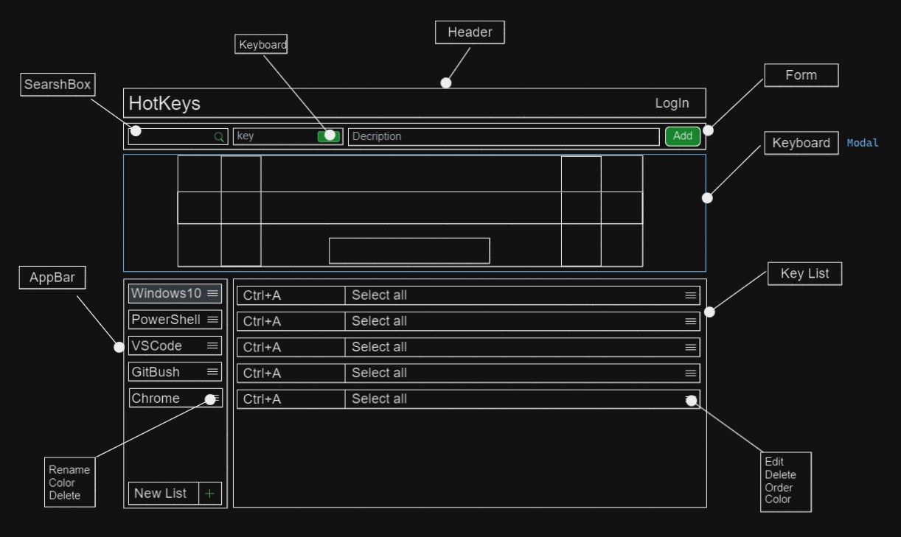

# HotKeys

Додаток створений для швидкого збереження сполучень клавіш, та швидкого доступу
до вже збережених.

## Інтерфейс

 Додаток має кілька блоків:

- Категорії (списки) з можливістю додавання нової категорії.
- Щоб додати новий запис необхідно створити або вибрати раніше створену
  категорію.
- Форма для додавання нового запису.
- Поле пошуку, пошук відбувається як по сполученнях так і по опису.

## Сценарій додавання

- Створюємо категорію
- Вибираємо створену категорію
- Заповнюємо поля `«ShortCut»` і `«Description»`
- Натискаємо `"Enter"` або кнопку `"+"`

## Важливо

На даний момент додаток ще в процесі розробки, тому ви можете ним скористатись
для ознайомчих цілей.

## Заплановано

- Додати функціонал введення сполучень клавіш в інпут, замість прописування
  буквами.
- Додати секцію із віртуальною клавіатурою.
- Додати меню на кожен пункт категорії, для перейменування, видалення...
- Додати меню на кожен пункт запису в таблиці, для редагування, кольорової
  мітки, видалення...
- Зробити стилізацію
- Зробити зберігання даних на бекенді. На даний момент дані зберігаються в
  localStorage
- Авторизація користувача, для синхронізації на різних девайсах користувача.
- Bugfix

## Від автора

Необхідність в такому додатку виникла в мене під час навчання, доводилось
запам'ятовувати багато матеріалу, в тому числі сполучень клавіш. Так як я друкую
"в сліпу", то ефективність моєї роботи напряму залежить від володіння
сполученнями клавіш у будь-якому програмному продукті. Для того щоб запам'ятати
всі сполучення клавіш потрібно багато повторень, але по факту не всі команди
викликаються під час робочого сеансу. Це означає що деякі забуваються. Тому цей
додаток має ідею шпаргалки.
